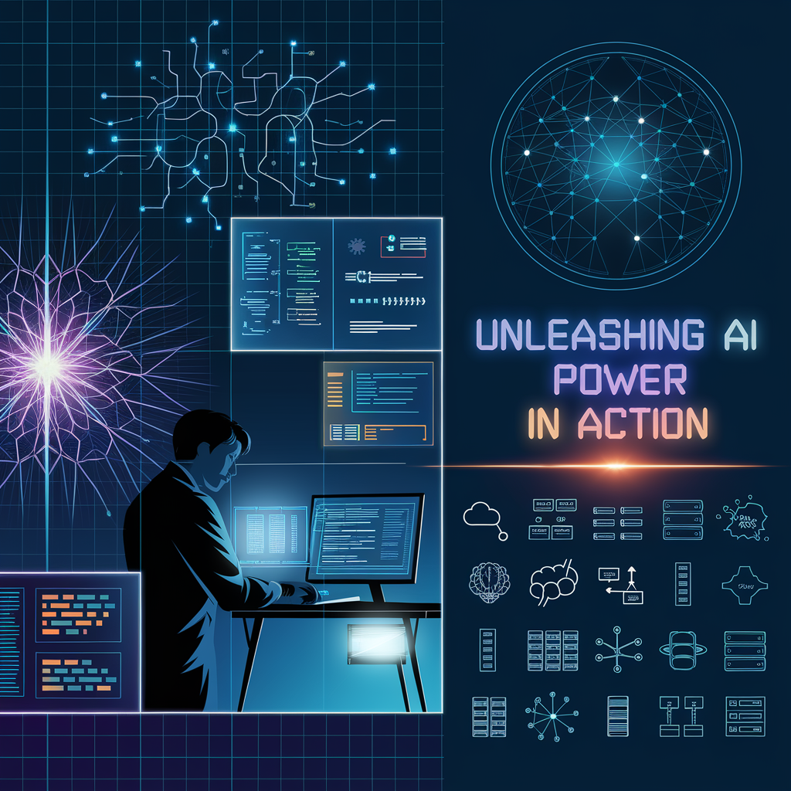

<!-- ========== HEADER SECTION ========== -->

  
  
  # 👨‍💻 MD MAHFUJUL KARIM SHEIKH
  
  ### 🚀 Data Scientist | Machine Learning Enthusiast | AI Explorer
  
  [][linkedin]
  [][youtube]
  [][facebook]
  
  
  
  

    <strong>📍 Khulna, Bangladesh</strong> | 
    <strong>🎓 Computer Science & Engineering</strong> | 
    <strong>💼 AI & Data Science Trainer</strong>
  

  
  ---

<!-- ========== ABOUT ME SECTION ========== -->

## 📌 About Me

  
  I am a passionate **Data Scientist** and **Machine Learning Enthusiast** dedicated to transforming raw data into actionable insights. With expertise in cutting-edge AI technologies, I specialize in building intelligent systems that solve real-world challenges.
  
  > 🎯 **Mission**: *Leverage AI & Data Science to create meaningful impact and drive innovation*

<table align="center">
  <tr>
    <td align="center" width="50%">
      <h4>🔍 What I Do</h4>
      <ul align="left">
        <li>🤖 Machine Learning & Deep Learning</li>
        <li>🗣️ Natural Language Processing</li>
        <li>📊 Big Data Analytics</li>
        <li>🔬 Research & Innovation</li>
        <li>📈 Data Visualization</li>
      </ul>
    </td>
    <td align="center" width="50%">
      <h4>🎯 My Passion</h4>
      <ul align="left">
        <li>✨ Building Smart Solutions</li>
        <li>🚀 Exploring New Technologies</li>
        <li>📚 Continuous Learning</li>
        <li>🌍 Community Contribution</li>
        <li>💡 Creative Problem Solving</li>
      </ul>
    </td>
  </tr>
</table>

---

<!-- ========== TECHNICAL SKILLS SECTION ========== -->

## 🛠️ Technical Skills

### 📚 **Core Technologies**

#### Data Science & AI

#### Web Development

#### Databases & Backend

#### DevOps & Tools

#### Programming Languages

### 🧠 **Specialized Skills**
- ✨ Artificial Intelligence & Machine Learning
- 📊 Data Analysis & Visualization
- 🔬 Research & Academic Studies
- 🎯 Problem Solving
- 💻 Numerical Methods & Discrete Mathematics
- 📡 Networking & Cybersecurity
- 🔧 Compiler Design
- 📝 Theory of Computation

---

## 📊 GitHub Statistics

  
  <table>
    <tr>
      <td width="50%">
        
      </td>
      <td width="50%">
        
      </td>
    </tr>
  </table>
  
  
  
  
  

---

<!-- other skills and my videos for computer science section starts here  -->

<!-- ========== TRAINING HISTORY SECTION ========== -->

## 💼 Professional Training & Experience

| 🏢 Position | 🏫 Institute | ⏱️ Duration | 📍 Location |
|:---|:---|:---|:---|
| **🎓 Trainee (Data Analysis)** | AiQuest Intelligence | Mar 2024 - Oct 2024 | Dhaka (Remote) |
| **🤖 Trainee (Data Science)** | Khulna University (Edge Project) | Apr 2024 - Oct 2024 | Khulna, Bangladesh |
| **🧠 Trainee (Machine Learning)** | KUET (Edge Project) | Nov 2024 - Present | Khulna, Bangladesh |
| **🎨 Trainee (AI for Immersive Tech)** | KUET (BDSET Project) | Oct 2024 - Present | Khulna, Bangladesh |

---

<!-- ========== EDUCATION SECTION ========== -->

## 🎓 Education

<table align="center" width="100%">
  <tr>
    <td width="50%">
      <h4>🏫 Bachelor's Degree</h4>
      
<strong>B.Sc. in Computer Science & Engineering</strong>

      
Northern University of Business and Technology

      
Khulna, Bangladesh

    </td>
    <td width="50%">
      <h4>📜 Advanced Diploma</h4>
      
<strong>Advanced Diploma in Software Engineering</strong>

      
Khulna University of Engineering and Technology

      
Bangladesh

    </td>
  </tr>
</table>

---

<!-- ========== LANGUAGES SECTION ========== -->

## 🌍 Languages

| Language | Proficiency | Level |
|:---|:---|:---|
| 🇧🇩 **Bangla** | Native Speaker | ⭐⭐⭐⭐⭐ |
| 🏴󠁧󠁢󠁥󠁮󠁧󠁿 **English** | Professional Working | ⭐⭐⭐⭐ |

---

<!-- ========== INTERESTS & HOBBIES SECTION ========== -->

## 🎯 Interests & Hobbies

### 🏆 Sports & Games

### 🏃 Fitness & Activities

---

<!-- ========== QUICK LINKS & RESOURCES ========== -->

## 📚 Quick Links & Resources

---

<!-- ========== FOOTER SECTION ========== -->

## 🚀 Let's Connect & Collaborate!

I'm always excited to discuss new ideas, projects, and opportunities in the field of **Data Science, Machine Learning, and AI**. Whether you're looking to collaborate on a groundbreaking project, need consultation on data-driven solutions, or just want to chat about AI trends, feel free to reach out!

**📧 [Get In Touch](mailto:your-email@gmail.com)** | **💼 [LinkedIn Profile][linkedin]** | **🐙 [GitHub Profile](https://github.com/mahfujul-01726)**

---

### ✨ *"Data is the new oil, and Machine Learning is the engine that powers the future!"* ✨

**Made with ❤️ by [MD MAHFUJUL KARIM SHEIKH](https://github.com/mahfujul-01726)**

⭐ If you find my profile interesting, please give it a **star** and **follow** for more amazing content!

Last Updated: **May 2024** | Status: **Always Learning & Growing** 🌱

---

All rights reserved by Md Mahfujul Karim Sheikh @2024

---

<!-- Links section starts here -->

[youtube]: https://www.youtube.com/@md.mahfujulkarim2427
[facebook]: https://www.facebook.com/Md.mahfujule.islam.5
[linkedin]: https://www.linkedin.com/in/md-mahfujul-karim-sheikh-12b85b202/
[github]: https://github.com/Mahfujul-01726

<!-- Links section ends here -->
